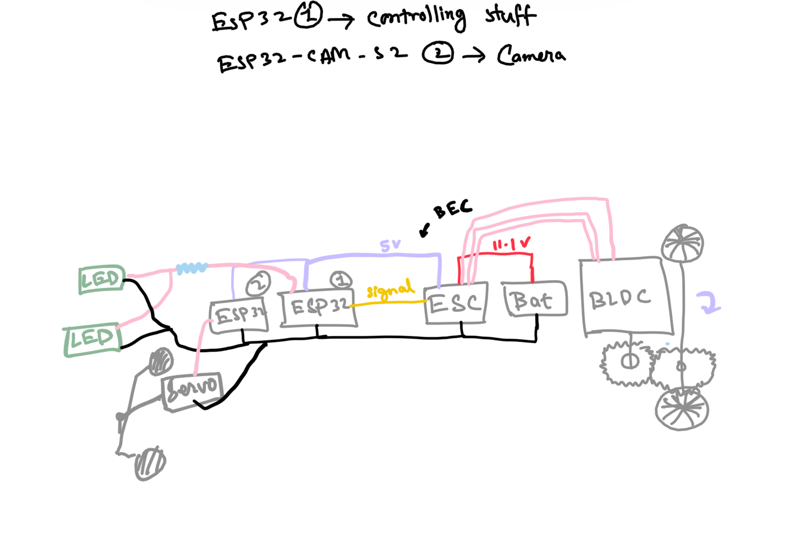
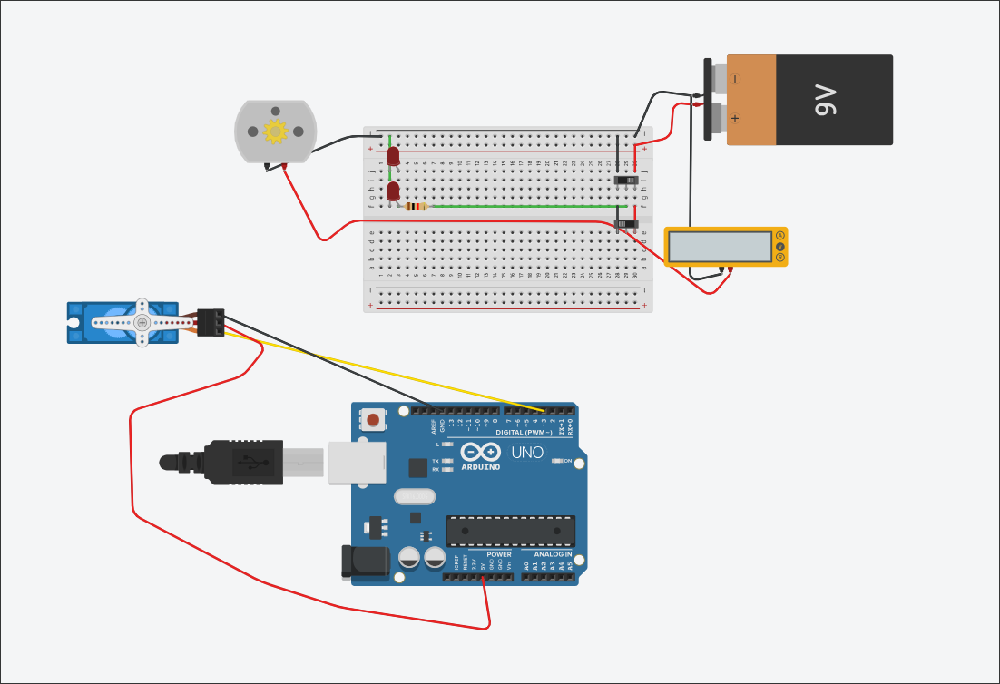
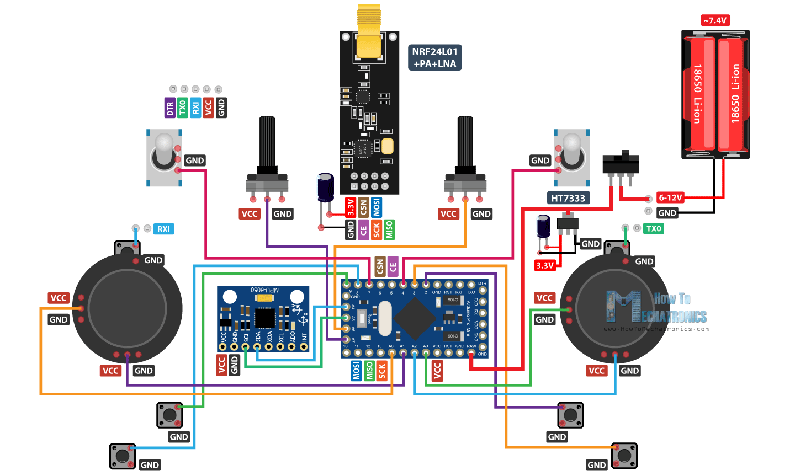
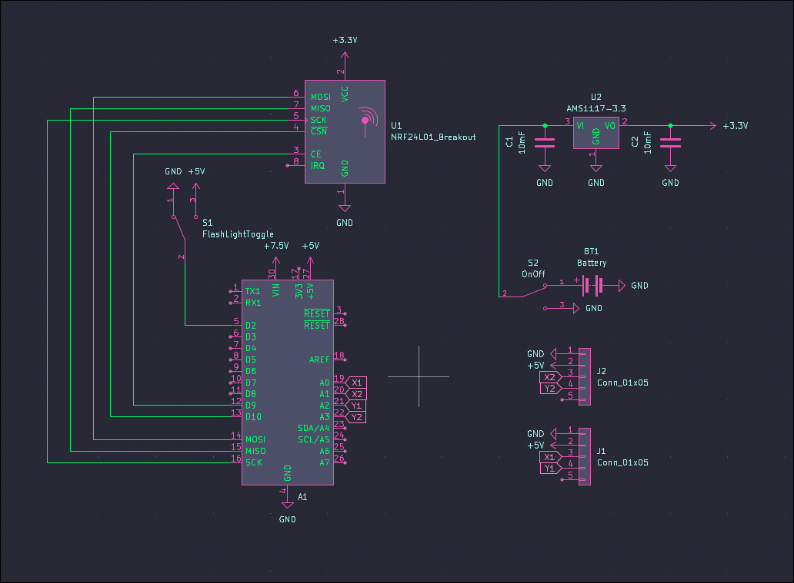
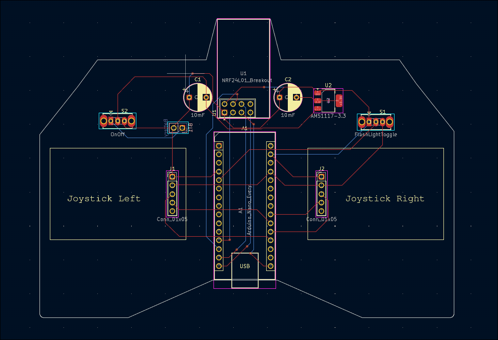
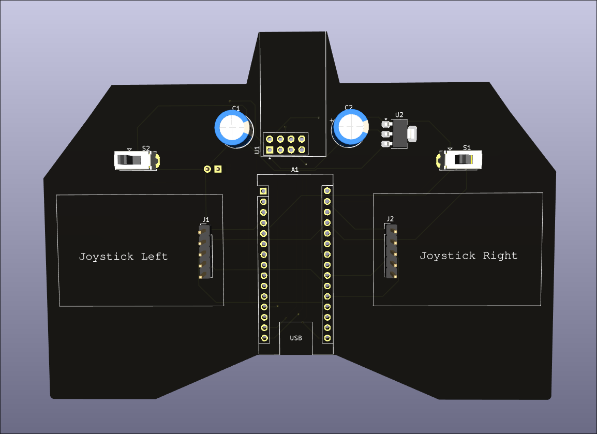
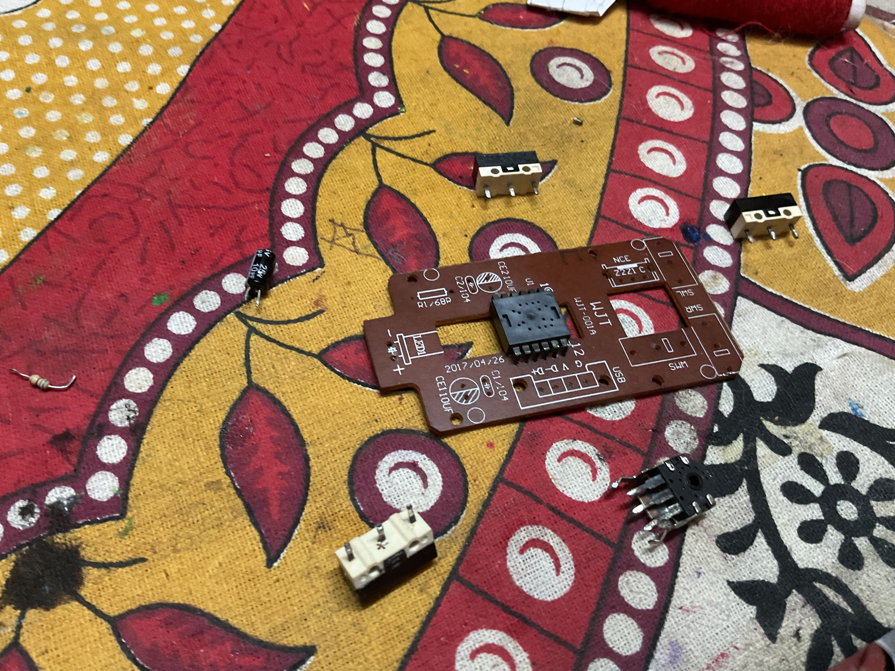

# Thunder

### Total time spent : 14hrs

## May 23rd

### Time spent : ~2.5 hrs

Brainstormed my project, its going to be an **FPV RC car** so that I can race around my home, I am honestly really excited to build this thing, I have always wanted to make something like this.
Also did a lot of research on RC cars, saw other RC cars, and ton of yt vids and got an idea on where to start.

Made a rough circuit diagram, might be incorrect tbh, still continuing my research. Also did some testing in tinkercad.
So far learned about ESCs & BECs(which, if I am not wrong, are built-in most ESCs) though I couldn't find them in any simulator as a component, so ig for simulation I have to make my own ESC and BEC. 

I also made a roadmap kind of thing so that I know what I need to do after each step.
I plan to learn about some parts first, select which ones to use in my project and then start designing the chassis, once I am done with the chassis model,I want to work on the PCB designing part, and finally the outer 3d model. 

( _I plan to use ESP-32s, but as I am just testing, I think arduino would work just fine..._ )

## May 25-26th

### Time spent : ~ 2hrs

I did some of research on transmitters and receivers which I think would be the hardest part in this project. I initially thought of using ESP32s but I think using 2 microcontrollers for this just doesn't make sense, atleast not when I can do it without microcontrollers + They would limit the range by a lot. 

I am thinking of going with a 5.8Ghz , 4-5-channel trasmitter and receiver(I would be using just 3 of them but would keep some incase of future extension of the project). I would be using one channel for steering, one for throttle and the last for headlights. To make this project cooler, I would make the transmitter and receiver myself!

I already started a project in kicad, did nothing till now, currently finding symbols and footprints

I would be using an overall schematic similar to this that I found on the internet, I honestly don't know a lot about all components yet, so I would only place stuff in kicad when I know what it does.

## May 27-28

### Time spent: ~5.5hrs

Did a lot more research on parts that I would be using. Finally got some real work done today, finished the schematic for the transmitter!
Had some real trouble finding footprints and symbols, but other hackclubbers helped me out with that through slack!

Also started working on the PCB, should hopefully finish the PCB by tommorrow!

## May 30-31

### Time spent: ~4hrs

Couldn't work yesterday, have been focusing on studies for a while...

But, I completed the PCB for my transmitter! I tried to find out some platforms for buying the components too. 

Found out about [ebhoot.in](https://ebhoot.in) and [robosap.in](https://robosap.in)(finally something that supports hcb 😭), from another hackclubber, both are really great places to buy the required components, cheap and they are indian(so significantly less shipping charges)!

I would work on a case for it later on, but for now ig its time to begin with the chasis! 

Here are a few pics of what I have completed so far:

Yet to add some silkscreen though.... its looking a bit too empty for now

At the mean time also practiced soldering and desoldering(just got my hackpad soldering kit)!
Took out few components out of an old mouse PCB for practice. I would solder them back tommorrow.

